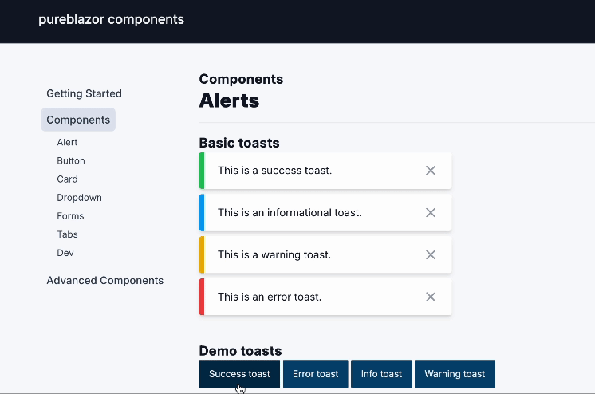
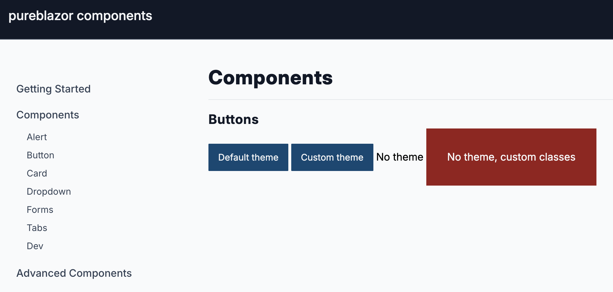
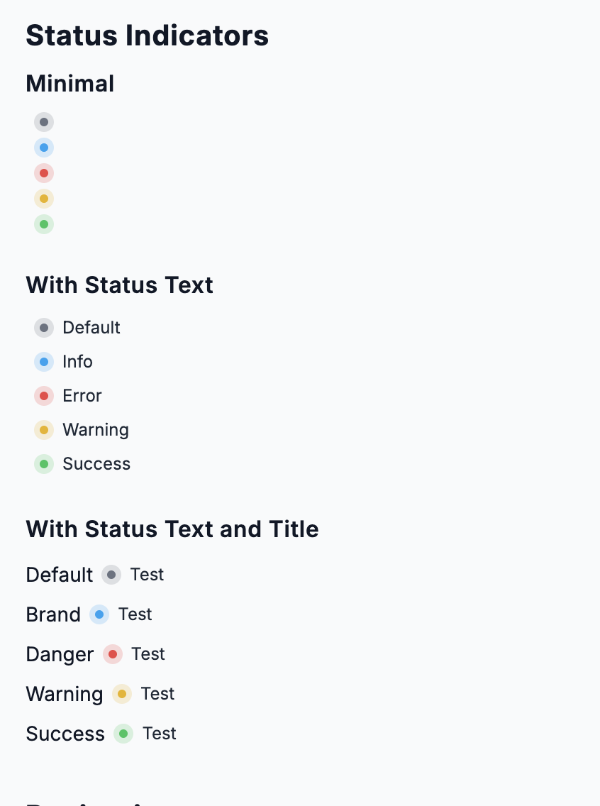
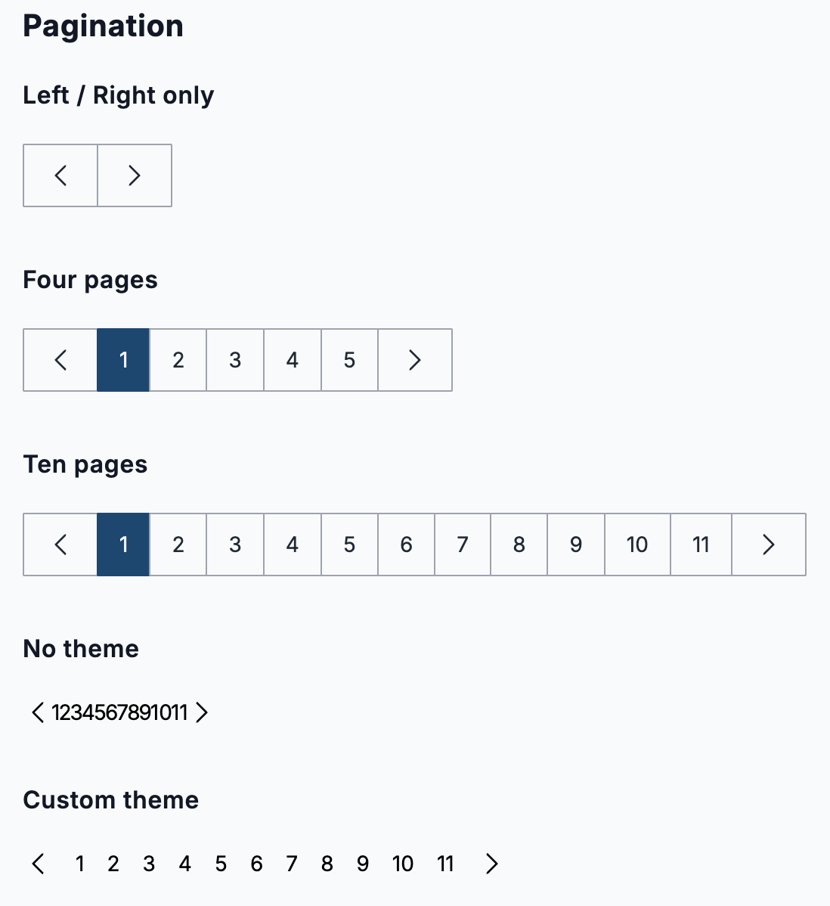

[](https://discord.gg/PeBbYy6WKq)
[)](https://pureblazor.com)

# PureBlazor Components

> [!NOTE]
> This component library is pre-release software.


Native Blazor UI components. Free to use for any Blazor project. Works seamlessly
with [PureBlazor CMS](https://pureblazor.com).

# Features

- **Native Blazor** - Built for Blazor, not a wrapper around a JavaScript library.
- **Blazing Fast** - Built with performance in mind.
- **Headless Mode** - Turn off the default theme globally or per component.
- **Tailwind Compatible** - Automatically merges your Tailwind classes with built-in styles.

[Explore Components](https://components.wasmhost.dev/alerts)

[Benchmarks](/tests/Benchmarks/BenchmarkDotNet.Artifacts/results)

# Getting started

## Installation

Install the `PureBlazor.Components` NuGet package.

```sh
dotnet add package PureBlazor.Components
```

Include the following scripts in your `App.razor` file. Change your `brand` colors to match your desired primary color.

```razor
<script src="https://cdn.tailwindcss.com"></script>
<script>
    tailwind.config = {
        darkMode: 'class',
        theme: {
            extend: {
                fontFamily: {
                    sans: ['Inter var', 'ui-sans-serif', 'system-ui', '-apple-system', 'BlinkMacSystemFont', "Segoe UI", 'Roboto', "Helvetica Neue", 'Arial', "Noto Sans", 'sans-serif', "Apple Color Emoji", "Segoe UI Emoji", "Segoe UI Symbol", "Noto Color Emoji"],
                },
                borderRadius: {
                    'xs': '0.0625rem',
                },
                colors: {
                    brand: {
                        '50': '#eff9ff',
                        '100': '#dff1ff',
                        '200': '#b7e5ff',
                        '300': '#77d1ff',
                        '400': '#2fbbff',
                        '500': '#04a3f3',
                        '600': '#0081d0',
                        '700': '#0067a8',
                        '800': '#015486',
                        '900': '#074873',
                        '950': '#052e4c',
                    },
                }
            }
        },
    }
</script>
```

> [!NOTE]
> The Nuget package currently only supports use with
> the [Tailwind CDN](https://tailwindcss.com/docs/installation/play-cdn).
>
> Compile time support will come in the future. If you want compile-time CSS, add the `PureBlazor.Components` project
> directly to your solution.

## Screenshots






# FAQ

### Why not use `xx` library?

- There are many great libraries out there, but we wanted to build something that was simple and easy to use. We also
  wanted to build something that was tailored to the PureBlazor CMS.
- We also wanted to build something that was fast. We have a benchmark suite in `/tests/benchmarks` that we use to
  measure performance.
- Ultimately, we think there is plenty of room for more libraries in the Blazor ecosystem.

### Is this library free to use?

- Yes! This library is free to use for any Blazor project.

### Can I use this library with .NET MAUI Blazor projects?

- This library should work with .NET MAUI, but we have not tested it yet. Please let us know if you have any issues.

### Can I use this library with Blazor WebAssembly / Blazor Server / InteractiveAuto?

- Yes. This library supports all Blazor hosting models.

### Is this library production-ready?

- No. This library is still in development.

### Do you accept contributions?

- Yes! We accept contributions. Please see the [CONTRIBUTING.md](CONTRIBUTING.md) file for more information.

### How do I report a bug?

- Please open an issue on the [GitHub repository](https://github.com/pureblazor/components/issues/new/choose).
- Please include as much information as possible, including the version of the library you are using, the browser you
  are using, and any steps to reproduce the issue.
